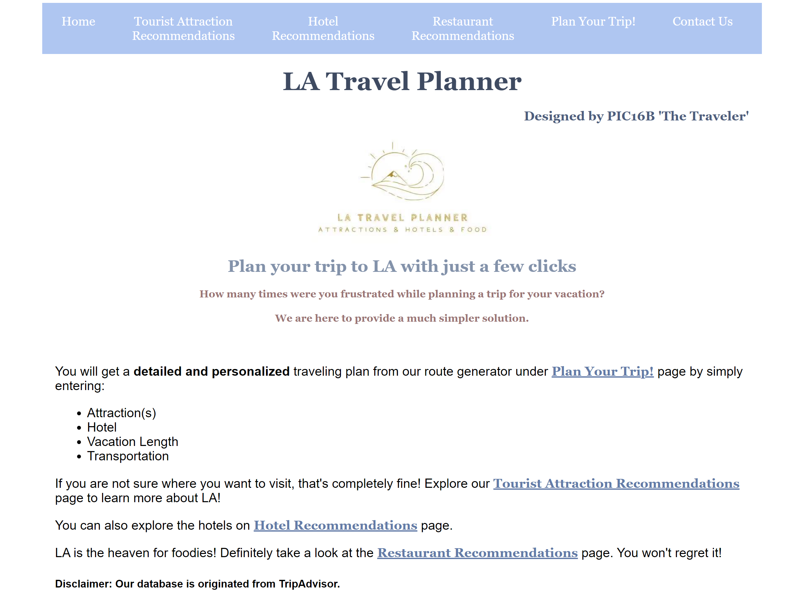

# PIC16b Project
**Contributers:**

Ashley Lu

Jaya Ren

Jingxuan Zhang

## LA Travel planner


<!-- TABLE OF CONTENTS -->
<details open="open">
  <summary><h2 style="display: inline-block">Table of Contents</h2></summary>
  <ol>
    <li>
      <a href="#about-the-project">About The Project</a>
      <ul>
        <li><a href="#built-with">Built With</a></li>
      </ul>
    </li>
    <li>
      <a href="#getting-started">Getting Started</a>
      <ul>
        <li><a href="#installation">Installation</a></li>
        <li><a href="#Execution">Execution</a></li>
      </ul>
    </li>
    <li><a href="#usage">Usage</a></li>
    <li><a href="#Ethics">Ethics</a></li>
    <li><a href="#Limitations">Limitations</a></li>
    <li><a href="#Group-Contribution">Group Contribution</li>
    <li><a href="#acknowledgements">Acknowledgements</a></li>
  </ol>
</details>

<!-- ABOUT THE PROJECT -->
## About The Project



When it comes to traveling, sometimes it can be a struggle to plan out where you want to go, especially if you're going somewhere you've never been to before. Our project aims to create a travel planning tool that gives attraction, hotel, and food recommendations to LA tourists, and provides a detailed and personalized travel plan based on users' selections, including attractions to go for each day and a route recommendation.


### Built With

* [Beautiful Soup](https://www.crummy.com/software/BeautifulSoup/bs4/doc/):
Beautiful Soup is a commonly used Python Library by programmers for webscraping. We use Beautiful Soup to get the data, which are saved in CSV files, through webscraping.
* [Geopy](https://geopy.readthedocs.io/en/stable/#nominatim):
Geopy is a Python client for geocoding that obtains the longitude/latitude coordinates for an address. We make use of Nominatim from Geopy, which is a geocoder for OpenStreetMap (OSM), an open data map of the world.
* [OSRM](http://project-osrm.org/docs/v5.24.0/api/#):
OSRM is a routing engine that uses OpenStreetMap (OSM) data to generate the shortest routes between locations. By sending a request to OSRM, you obtain a Polyline encoding that contains information such as the route, distance, and duration.
* [Polyline](https://polyline.readthedocs.io/en/v1.1/):
We use the Python implementation of Polyline, which is Google's Encoded Polyline Algorithm Format that stores a series of coordinates as an encoded string.
* [Folium](http://python-visualization.github.io/folium/):
We use Folium to visualize route data on an interactive leaflet map. Folium supports Polyline, so it is the best module to use with OSRM.
* [Flask](https://flask.palletsprojects.com/en/2.0.x/):
We used Flask to develop our webapp for this project. Since it's written in Python, it makes it easier for us to directly call the functions we have created before in Jupyter Notebook.


<!-- GETTING STARTED -->
## Getting Started

To get a local copy up and running follow these simple steps.


### Installation

1. Clone the repo
   ```sh
   $ git clone https://github.com/jren99/pic16b_project.git
   ```
2. Install packages  
make sure you are in the folder `pic16b_project`
   ```sh
   $ pip install -r requirements.txt
   ```
### Execution  

make sure your current working directory is `pic16b_project/webapp`
```sh
   $ python3 app.py
   ```


<!-- USAGE EXAMPLES -->
## Usage
After the users open the webapp locally on their computers, the users can see **six clickable buttons** in the navigation bar on the top of the home page:
* **Home**: This page mainly consists of a brief description of our project, including the main purpose and the basic structure.
* **Tourist Attraction Recommendations**: Users will see a data list of all the recommended tourist attractions that we got the data through webscraping on TripAdvisor when they first open this page. After the users input a keyword in the search box and click **Search**, they may see another **two clickable buttons**. The users may click **Click here to see all the possible tourist sites** to see a filtered data list with all the tourist sites containing that keyword. If the users want to try again to input another keyword, the users may click **Try a new keyword**.
* **Hotel Recommendations**: The users are also able to check out the hotels in LA. Similarly, the users will see a list of recommended hotels in LA. Users are allowed to input either a keyword or a number that represents the minimum rating of hotels they want to see. As a result, they will see a filtered list of hotels either containing the keyword or rating higher than the input number.
* **Restaurant Recommendations**: After the users entering this webpage, the users will be able to see a data list containing all the recommended restaurants in LA. The users can also filter the data list based on their input keyword or number, such as entering Japanese to search for all the restaurants that provided Japanese food or entering 4 to see all restaurants with rating higher than 4.
* **Plan Your Trip!**: Based on the recommended tourist attraction list and the recommended hotel list, the users are required to give four inputs, which are the tourist attractions they are interested in, the number of days they plan to stay, one hotel they plan to stay, and the mode of transportation they are going to use. After the users click **Search for an optimized route**, they need to follow the steps below to obtain their personalized travel plan:
	* **Step One: Click here to generate route.**: The users need to click this button first. Our webapp will automatically start webscraping the locations of the places the users want to go and then generate the route. This might take a little while based on the number of places the users want to go. After it finishes loading, the user may proceed to the next step.
	* **Step Two: Click here to see the Day-n route.** (where n depends on the number of days the users' input): After the webpage has finished loading, the users will be able to see a short summary of the travel planner, including the travel distance and duration for each day. They may click on buttons below to see each day's route we generated for them. Note that the number of days must be no larger than the number of attractions.
	* **Plan a new trip: Click here.**: This button is for users to enter different inputs to generate a new travel plan.
* **Contact Us**: We appreciate any feedback for our project. Feel free to submit anything you want to tell us via the google form.

<!-- ETHICS -->
## Ethics

Depending on what recommendations Tripadvisor gives us, maybe the sightseeing locations will privilege some cultural sites above others, depending on what races and ethnicities are more prevalent in a location. Also, if we’re recommending sightseeing and hotel locations, Tripadvisor might favor larger and more popular sites rather than smaller sites. As popularity is largely based on positive reviews, it's hardly objective since there are many bogus positive reviews.

<!-- LIMITATIONS -->
## Limitations

* Because of the inefficiency of scraper, we were only able to obtain a dataset for LA instead of California or even larger range. Hence, our webapp is limited to users who want to plan a trip to LA. However, we believe a more efficient scraping method can potentially extend the functionality of our app to larger area.
* As our recommendations for hotels, food, and attractions are based on matching keywords, this could lead to certain inaccuracy. For example, Getty Center is a museum but doesn't contain the word "museum" in its name, so it won't be included as one of the search results. Smarter search method or better dataset will be needed for further improvement.
* This planner can only plan up to 10 tourist sites.
* Users cannot create an account to save browsing history.
* Generating the most optimal travel plan such that the user can choose some arbitrary number of attractions and days to stay in LA would be a very difficult problem. To determine the distance/duration of each possible route, we would have to send multiple requests to OSRM, which would be time-consuming and inefficient. We could also treat this as a Traveling Salesman type of problem, but it's unrealistic to construct such a route that passes through all the attractions and find nearby hotels for each of them. We think it makes more sense to have one hotel that the user stays in and use it as the starting point for each day's route. It might also be realistic to add an option for two hotels as well, though our implementation currently does not support this.
* Currently, the route visualization doesn't support having a greater number of
days than locations. The *locations_per_day* function creates empty lists for
days that have no locations, but the later functions do not take into account
the possibility that there are empty lists, so there will be index out of range
errors.

<!-- GROUP CONTRIBUTION -->
## Group Contribution

* Ashley Lu: I created the "back-end" route visualizer that obtains the lat/lon coordinates for the addresses, generates the random travel plan based on the user's preferred number of attractions and days they will be staying in LA, and plots the route information on an interactive map.

* Jaya Ren: I built the first version of the webapp using php and html (see folder `django and php test files`) and worked with Stancy to build the final version of the webapp using flask.

* Jingxuan(Stancy) Zhang: I extracted the data of the recommended tourist sites, hotels, and restaurants on TripAdvisor by webscraping and saved those extracted data into separated CSV files (see both the webscraping codes and CSV files in folder `webscraping`). I also created the first version of the webapp using Flask and finished building it with Jaya.


<!-- ACKNOWLEDGEMENTS -->
## Acknowledgements

* [TripAdvisor](https://www.tripadvisor.com/): Since our project aims to provide a list of hotels, attractions, and restaurants recommendations, we need reliable and latest data sets. Hence, we accessed the information above from TripAdvisor.
* [OpenStreetMap](https://www.openstreetmap.org/copyright): OSM provides all of the map data we use to generate the routes and create the route visualizations. We are very thankful that such an amazing service is open-source!
* [Worth Web Scraping - Mike](https://www.youtube.com/watch?v=HMkckLiHOio): We learned how to use BeautifulSoup for webscraping based on this video though we used a different method for webscraping. Thank you so much for making this tutorial video!
* [teclado](https://www.youtube.com/watch?v=mCy52I4exTU&t=7s): Thank you for the tutorial about how to show a dataframe on the web app!
